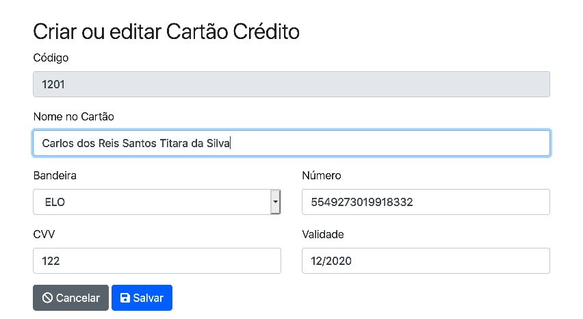
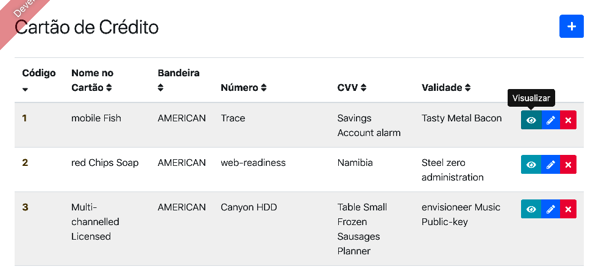

# BestMeal - Melhorias

## Que melhorias faremos?

> O JHipster é uma ferramenta excelente mas após a geração da aplicação, a medida que vamos usando, percebemos algumas oportunidades de
> melhoria, por exemplo: layout dos formulários, dicas nos botões (tooltip), acentuações nas palavras etc.

## Então vamos tornar a nossa aplicação mais profissional

### 1)Substituir o 'true' e o 'false' do atribuito 'Disponível' do Menu por um ícone.

::: :walking: Passo a passo :::

1. Iremos usar dois ícones (check e times). Esses ícones precisam fazer parte do arquivo `vendor.ts`. Altere o arquivo conforme Listagem 1.

```typescript
import { library } from '@fortawesome/fontawesome-svg-core';
import {
  faUser,
  faSort,
...
  faHome, //>> alterado aqui
  faCheck //>> alterado aqui

} from '@fortawesome/free-solid-svg-icons';
...

library.add(faAsterisk);
library.add(faCheck); //>> alterado aqui
```

<p align="center">
   <strong>Listagem 1- arquivo vendor.ts</strong> 
</p>

2. Para usar os ícones importados na biblioteca no passo anterior, altere o arquivo `menu.component.html` conforme Listagem 2.

```html
<tr *ngFor="let menu of menus ;trackBy: trackId">
  <td><a [routerLink]="['/menu', menu.id, 'view' ]">{{menu.id}}</a></td>
  <td>{{menu.nome}}</td>
  <td jhiTranslate="{{'bestMealApp.GrupoMenu.' + menu.grupo}}">{{menu.grupo}}</td>
  <!--        <td>{{menu.isDisponivel}}</td>  Exclua essa linha-->
  <!--Acrescente as 3 linhas seguintes -->
  <td class="text-left">
    <fa-icon
      [icon]="menu.isDisponivel ? 'check' : 'times'"
      aria-hidden="true"
      class="{{menu.isDisponivel ? 'text-success' : 'text-danger'}}"
    ></fa-icon>
  </td>
</tr>
```

<p align="center">
   <strong>Listagem 2 -Alteração no arquivo menu.component.html </strong> 
</p>

> Perceba que a expressão `menu.isDisponivel ? 'check' : 'times'` é um `if`. Similarmente, a tag `class` também usa um comando condicional.

### 2)Alteração de layout do formulário `cartao-credtio-update.componente.html`.

> Em páginas htmls modernas, a alteração do layout é feita com base no `CSS`. E é isso que iremos fazer, ou seja usar uma `class` que melhor se adapte ao layout que prentedemos.

> Nesta aplicação está sendo a biblioteca de estilos denominada `Bootstrap`. O Bootstrap é um kit de ferramentas de código aberto para desenvolvimento com HTML, CSS e Java Script que possibilita a você criar protótipos de suas ideias ou construir seu aplicativo inteiro com um sistema de `grid` responsivo, além de possuir componentes pré-construídos e poderosos plugins construídos em jQuery.

> O `Bootstrap` divide a largura da tela em 12 colunas. Isso significa que se você usar a classe `col-sm-6` en um componente, ele ira ocupar a metade da tela. Se usar `col-sm-4`, irá ocupar 1/3 da tela e assim por diante.

1. Vamos alterar o lay-out do formulário cartao-credito para que fique conforme Figura 1.

<p align="center">
  
</p>
<p align="center">
   <strong>Figura 1- Novo Layout para o formulario Cartao de Credito</strong> 
</p>

2. Para alterar proceda assim:

- Use `<div class="row">` para mudar de linha

- Use `<div class="form-group col-sm-12">` para colocar que um componente ocupe uma linha inteira

- Use `<div class="form-group col-sm-6">` para colocar um componente em 2 colunas

3. O seu arquivo deverá ficar conforme Listagem 3

```html
<div class="row justify-content-center">
  <div class="col-sm-6">
    <form name="editForm" role="form" novalidate (ngSubmit)="save()" [formGroup]="editForm">
      <h2 id="jhi-cartao-credito-heading" jhiTranslate="bestMealApp.cartaoCredito.home.createOrEditLabel">
        Create or edit a Cartao Credito
      </h2>
      <div>
        <jhi-alert-error></jhi-alert-error>
        <div class="form-group" [hidden]="!cartaoCredito.id">
          <label for="id" jhiTranslate="global.field.id">ID</label>
          <input type="text" class="form-control" id="id" name="id" formControlName="id" readonly />
        </div>

        <div class="row">
          <div class="form-group col-sm-12">
            <label class="form-control-label" jhiTranslate="bestMealApp.cartaoCredito.nomeCartao" for="field_nomeCartao">Nome Cartao</label>
            <input type="text" class="form-control" name="nomeCartao" id="field_nomeCartao" formControlName="nomeCartao" />
            <div *ngIf="editForm.get('nomeCartao').invalid && (editForm.get('nomeCartao').dirty || editForm.get('nomeCartao').touched)">
              <small
                class="form-text text-danger"
                *ngIf="editForm.get('nomeCartao').errors.required"
                jhiTranslate="entity.validation.required"
              >
                This field is required.
              </small>
              <small
                class="form-text text-danger"
                *ngIf="editForm.get('nomeCartao').errors.minlength"
                jhiTranslate="entity.validation.minlength"
                [translateValues]="{ min: 10 }"
              >
                This field is required to be at least 10 characters.
              </small>
              <small
                class="form-text text-danger"
                *ngIf="editForm.get('nomeCartao').errors.maxlength"
                jhiTranslate="entity.validation.maxlength"
                [translateValues]="{ max: 40 }"
              >
                This field cannot be longer than 40 characters.
              </small>

              <small
                class="form-text text-danger"
                *ngIf="editForm.get('nomeCartao').errors.jhiForbiddenName"
                jhiTranslate="entity.validation.forbiddenName"
                [translateValues]="{ forbiddenName: 'bosco' }"
              >
                This field cannot be longer than 40 characters.
              </small>
            </div>
          </div>
        </div>
        <div class="row">
          <div class="form-group col-sm-6">
            <label class="form-control-label" jhiTranslate="bestMealApp.cartaoCredito.bandeira" for="field_bandeira">Bandeira</label>
            <select class="form-control" name="bandeira" formControlName="bandeira" id="field_bandeira">
              <option value="AMERICAN">{{'bestMealApp.Bandeira.AMERICAN' | translate}}</option>
              <option value="DINERS">{{'bestMealApp.Bandeira.DINERS' | translate}}</option>
              <option value="ELO">{{'bestMealApp.Bandeira.ELO' | translate}}</option>
              <option value="MASTER">{{'bestMealApp.Bandeira.MASTER' | translate}}</option>
              <option value="VISA">{{'bestMealApp.Bandeira.VISA' | translate}}</option>
            </select>
          </div>
          <div class="form-group col-sm-6">
            <label class="form-control-label" jhiTranslate="bestMealApp.cartaoCredito.numero" for="field_numero">Numero</label>
            <input type="text" class="form-control" name="numero" id="field_numero" formControlName="numero" />
            <div *ngIf="editForm.get('numero').invalid && (editForm.get('numero').dirty || editForm.get('numero').touched)">
              <small
                class="form-text text-danger"
                *ngIf="editForm.get('numero').errors.pattern"
                jhiTranslate="entity.validation.pattern"
                [translateValues]="{ pattern: 'Numero' }"
              >
                This field should follow pattern for "Numero".
              </small>
            </div>
          </div>
        </div>
        <div class="row">
          <div class="form-group col-sm-6">
            <label class="form-control-label" jhiTranslate="bestMealApp.cartaoCredito.cvv" for="field_cvv">Cvv</label>
            <input type="text" class="form-control" name="cvv" id="field_cvv" formControlName="cvv" />
            <div *ngIf="editForm.get('cvv').invalid && (editForm.get('cvv').dirty || editForm.get('cvv').touched)">
              <small class="form-text text-danger" *ngIf="editForm.get('cvv').errors.required" jhiTranslate="entity.validation.required">
                This field is required.
              </small>
              <small
                class="form-text text-danger"
                *ngIf="editForm.get('cvv').errors.pattern"
                jhiTranslate="entity.validation.pattern"
                [translateValues]="{ pattern: '999' }"
              >
                This field should follow pattern for "Cvv".
              </small>
            </div>
          </div>
          <div class="form-group col-sm-6">
            <label class="form-control-label" jhiTranslate="bestMealApp.cartaoCredito.validade" for="field_validade">Validade</label>
            <input type="text" class="form-control" name="validade" id="field_validade" formControlName="validade" />
            <div *ngIf="editForm.get('validade').invalid && (editForm.get('validade').dirty || editForm.get('validade').touched)">
              <small
                class="form-text text-danger"
                *ngIf="editForm.get('validade').errors.required"
                jhiTranslate="entity.validation.required"
              >
                This field is required.
              </small>
              <small
                class="form-text text-danger"
                *ngIf="editForm.get('validade').errors.pattern"
                jhiTranslate="entity.validation.pattern"
                [translateValues]="{ pattern: 'mm/yyyy' }"
              >
                This field should follow pattern for "Validade".
              </small>
              <small
                class="form-text text-danger"
                *ngIf="editForm.get('validade').errors.validadeCart"
                jhiTranslate="entity.validation.validadeCart"
                [translateValues]="{ mesanoMin: mesano}"
              >
                This field should follow pattern for "Validade".
              </small>
            </div>
          </div>
        </div>
      </div>
      <div>
        <button type="button" id="cancel-save" class="btn btn-secondary" (click)="previousState()">
          <fa-icon [icon]="'ban'"></fa-icon>&nbsp;<span jhiTranslate="entity.action.cancel">Cancel</span>
        </button>
        <button type="submit" id="save-entity" [disabled]="editForm.invalid || isSaving" class="btn btn-primary">
          <fa-icon [icon]="'save'"></fa-icon>&nbsp;<span jhiTranslate="entity.action.save">Save</span>
        </button>
      </div>
    </form>
  </div>
</div>
```

<p align="center">
   <strong>Listagem 3 -Alteração no layout do `cartao-credtio-update.componente.html` </strong> 
</p>

### 3)Alteração dos labels do formulário `cartao-credtio-update.componente.html`.

> Como a nossa aplicação está preparada para o I18N, os labels são, na verdade, chaves para um arquivo `json` contendo os valores traduzidos. Portanto os valores dos novos labels deverão estar conforme a Listagem 4.

```json
{
  "bestMealApp": {
    "cartaoCredito": {
      "home": {
        "title": "Cartão de Crédito",
        "createLabel": "Adicionar um novo cartão de crédido",
        "createOrEditLabel": "Criar ou editar Cartão Crédito"
      },
      "created": "Um novo Cartão Crédito foi criado com o identificador {{ param }}",
      "updated": "Um Cartão Crédito foi atualizado com o identificador {{ param }}",
      "deleted": "Um Cartão Crédito foi excluído com o identificador {{ param }}",
      "delete": {
        "question": "Tem certeza de que deseja excluir Cartão Crédito {{ id }}?"
      },
      "detail": {
        "title": "Cartão de Crédito"
      },
      "nomeCartao": "Nome no Cartão",
      "bandeira": "Bandeira",
      "numero": "Número",
      "cvv": "CVV",
      "validade": "Validade"
    }
  }
}
```

<p align="center">
   <strong>Listagem 4 -Alteração nos valores dos labels utilizados no formulário `cartao-credtio-update.componente.html` </strong> 
</p>

### 4)Alterarando o lay-out do formulário que exibe a list dos cartões de crédito para que fique conforme Figura 2.

<p align="center">
  
</p>
<p align="center">
   <strong>Figura 2- Novo Layout para o formulario que exibe os Cartões de Crédito</strong> 
</p>

1. Adicionando `tooltip` no formulário `cartao-credtio.componente.html`

> Para adicionar `tooltip` iremos usar o atributo `ngbTooltip` na tag `button`. Esse atributo tem diversos ajustes que alteram o seu comportamento. Nesse primeiro momento vamos usar os ajustes-padrão.

> A sintaxe geral desse atributo é:

```html
<button type="submit" ... class="btn btn-info btn-sm" ngbTooltip="msg-que-será-mostrada"></button>
```

> Ocorre, entretanto, que estamos usando I18N, então ao invés de `"msg-que-será-mostrada"`, teremos que usar uma chave para ser traduzida, assim como fizemos com os labels.

> Assim a sintaxe ficará:

```html
<button type="submit" ... class="btn btn-info btn-sm" ngbTooltip="{{ 'entity.action.view' | translate }}"></button>
```

2. Retirando os labels dos botões.

> Para retirar os labels dos botões, basta retirar a instrução:

```html
<span class="d-none d-md-inline" jhiTranslate="entity.action.view">View</span>
```

- Então passe de:

```html
<button
  type="submit"
  [routerLink]="['/cartao-credito', cartaoCredito.id, 'view' ]"
  class="btn btn-info btn-sm"
  ngbTooltip="{{ 'entity.action.view' | translate }}"
>
  <fa-icon [icon]="'eye'"></fa-icon>
  <span class="d-none d-md-inline" jhiTranslate="entity.action.view">View</span>
</button>
```

- Para:

```html
<button
  type="submit"
  [routerLink]="['/cartao-credito', cartaoCredito.id, 'view' ]"
  class="btn btn-info btn-sm"
  ngbTooltip="{{ 'entity.action.view' | translate }}"
>
  <fa-icon [icon]="'eye'"></fa-icon>
</button>
```

> Faça o mesmo para os outros 2 botões

### 5)Alterarando a página principal.

1. Altere o arquivo `home.json` de:

```json
{
  "home": {
    "title": "Bem vindo, Java Hipster!",
    "subtitle": "Esta é a página principal",
```

- Para:

```json
{
  "home": {
    "title": "Bem Vindo ao BestMeal!",
    "subtitle": "",

```

2. No arquivo `home.component.html`, retire as seguintes linhas:

```html
<p jhiTranslate="home.question">
  If you have any question on JHipster:
</p>

<ul>
  <li><a href="https://www.jhipster.tech/" target="_blank" rel="noopener" jhiTranslate="home.link.homepage">JHipster homepage</a></li>
  <li>
    <a href="http://stackoverflow.com/tags/jhipster/info" target="_blank" rel="noopener" jhiTranslate="home.link.stackoverflow"
      >JHipster on Stack Overflow</a
    >
  </li>
  <li>
    <a
      href="https://github.com/jhipster/generator-jhipster/issues?state=open"
      target="_blank"
      rel="noopener"
      jhiTranslate="home.link.bugtracker"
      >JHipster bug tracker</a
    >
  </li>
  <li>
    <a href="https://gitter.im/jhipster/generator-jhipster" target="_blank" rel="noopener" jhiTranslate="home.link.chat"
      >JHipster public chat room</a
    >
  </li>
  <li>
    <a href="https://twitter.com/java_hipster" target="_blank" rel="noopener" jhiTranslate="home.link.follow"
      >follow @java_hipster on Twitter</a
    >
  </li>
</ul>

<p>
  <span jhiTranslate="home.like">If you like JHipster, don't forget to give us a star on</span>
  <a href="https://github.com/jhipster/generator-jhipster" target="_blank" rel="noopener" jhiTranslate="home.github">GitHub</a>!
</p>
```

### 6)Salve e teste a sua aplicação

### 7)Faça o mesmo para:

- Caertão Recompensa
- Menu
- Produto
