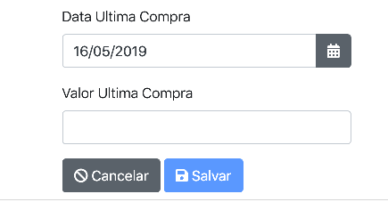

# BestMeal - Ajustes no DateTimePicker

## Por que ajustar as datas?

> Você já deve ter percebido que ao gerar a aplicação com o JHipster o formato da data é yyyy-MM-dd e não dd/MM/yyyy como usamos aqui no Brasil. Então para alterar esse comportamento, vamos fazer uma configuração no componente `NgbDatePicker`. Para fazer isso será preciso alterar o comportameto de formatação de datas desse componente. Essa alteração vem a calhar pois possibilita que seja mostrado um recurso importante do Angular: como estender componentes para alterar o comportamento padrão. E é isso que iremos fazer.

## Alterando o comportamento padrão do componente

> O comportamento que será alterado será a sua formatação, ou seja, a apresentação dos dados na view.

::: :walking: Passo a passo :::

1. Na pasta `src/main/webapp/app/shared/util` crie o arquivo `date-parser.formatter.ts` contendo a classe `DateParserFormatter`, conforme Listagem 1.

```typescript
import { Injectable, Inject } from '@angular/core';
import { NgbDateParserFormatter, NgbDateStruct } from '@ng-bootstrap/ng-bootstrap';

function padNumber(value: number) {
  if (isNumber(value)) {
    return `0${value}`.slice(-2);
  } else {
    return '';
  }
}

function isNumber(value: any): boolean {
  return !isNaN(toInteger(value));
}

function toInteger(value: any): number {
  return parseInt(`${value}`, 10);
}
@Injectable()
export class DateParserFormatter extends NgbDateParserFormatter {
  separator: string;
  ddIndex: number;
  mmIndex: number;
  yyIndex: number;
  anioSumar = 0;
  mask = 'dd/MM/yyyy';

  set Mask(value: string) {
    this.mask = value;
  }
  constructor() {
    super();
    this.separator = this.mask.indexOf('-') >= 0 ? '-' : this.mask.indexOf('.') >= 0 ? '.' : '/';
    // tslint:disable-next-line:prefer-const
    let part = this.mask.split(this.separator);
    this.ddIndex = part.indexOf('dd');
    this.mmIndex = part.indexOf('MM');
    this.yyIndex = part.indexOf('yyyy');
    if (this.yyIndex < 0) {
      this.yyIndex = part.indexOf('yy');
      this.anioSumar = 2000;
    }
  }
  parse(value: string): NgbDateStruct {
    if (value) {
      value = value.replace(/\.|\/|-/g, this.separator);
      const dateParts = value.trim().split(this.separator);
      if (dateParts.length !== 3) {
        return { year: 0, month: 0, day: 0 };
      }
      let anio = 0;
      let mes = 0;
      let dia = 0;
      const today = new Date();
      if (isNumber(dateParts[0]) && isNumber(dateParts[1]) && isNumber(dateParts[2])) {
        dia =
          this.ddIndex === 0
            ? toInteger(dateParts[0])
            : this.ddIndex === 1
            ? toInteger(dateParts[1])
            : this.ddIndex === 2
            ? toInteger(dateParts[2])
            : 0;
        mes =
          this.mmIndex === 0
            ? toInteger(dateParts[0])
            : this.mmIndex === 1
            ? toInteger(dateParts[1])
            : this.mmIndex === 2
            ? toInteger(dateParts[2])
            : 0;
        anio =
          this.yyIndex === 0
            ? dateParts[0].length < 2
              ? 0
              : toInteger(dateParts[0]) + this.anioSumar
            : this.yyIndex === 1
            ? dateParts[1].length < 2
              ? 0
              : toInteger(dateParts[1]) + this.anioSumar
            : this.yyIndex === 2
            ? dateParts[2].length < 2
              ? 0
              : toInteger(dateParts[2]) + this.anioSumar
            : 0;
      }
      if (dia === 0 || mes === 0 || anio === 0) {
        return { year: 0, month: 0, day: 0 };
      }
      if (anio < 100) {
        anio = 2000 + anio;
      }
      return { year: anio, month: mes, day: dia };
    }
    return { year: 0, month: 0, day: 0 };
  }

  format(date: NgbDateStruct): string {
    let stringDate = '';
    if (date) {
      const stringDay = isNumber(date.day) ? padNumber(date.day) : '';
      const stringMonth = isNumber(date.month) ? padNumber(date.month) : '';
      const stringYear = isNumber(date.year) ? (date.year - this.anioSumar).toString() : '';
      stringDate = stringDay
        ? this.mask.replace('dd', stringDay)
        : this.ddIndex === 0
        ? this.mask.replace('dd' + this.separator, '')
        : this.mask.replace(this.separator + 'dd', '');
      stringDate = stringMonth
        ? stringDate.replace('MM', stringMonth)
        : this.mmIndex === 0
        ? stringDate.replace('MM' + this.separator, '')
        : stringDate.replace(this.separator + 'MM', '');
      if (this.anioSumar) {
        stringDate = stringDay
          ? stringDate.replace('yy', stringYear)
          : this.yyIndex === 0
          ? stringDate.replace('yy' + this.separator, '')
          : stringDate.replace(this.separator + 'yy', '');
      } else {
        stringDate = stringDay
          ? stringDate.replace('yyyy', stringYear)
          : this.yyIndex === 0
          ? stringDate.replace('yyyy' + this.separator, '')
          : stringDate.replace(this.separator + 'yyyy', '');
      }
    }
    return stringDate;
  }
}
```

<p align="center">
   <strong>Listagem 1 - date-parser.formatter.ts </strong> 
</p>

2. Altere o arquivo denominado `app.module.ts`, conforme Listagem 2

```typescript
...
import { DateParserFormatter } from '../app/shared/util/date-parser.formatter';// >>> Alterado aqui
...

  providers: [
    {
      provide: HTTP_INTERCEPTORS,
      useClass: AuthInterceptor,
      multi: true
    },
    {
      provide: HTTP_INTERCEPTORS,
      useClass: AuthExpiredInterceptor,
      multi: true
    },
    {
      provide: HTTP_INTERCEPTORS,
      useClass: ErrorHandlerInterceptor,
      multi: true
    },
    {
      provide: HTTP_INTERCEPTORS,
      useClass: NotificationInterceptor,
      multi: true
    },
    { provide: NgbDateParserFormatter, useClass: DateParserFormatter } // >>> Alterado aqui
  ],
  ...
```

<p align="center">
   <strong>Listagem 2 - app.module.ts </strong> 
</p>

3. Pronto. Execute agora a aplicação com

```java

mvn

```

7. Testando a aplicação

<p align="center">
  
</p>
<p align="center">
   <strong>Figura 1- Imagem da formatação da data com dd/MM/yyyy</strong> 
</p>
